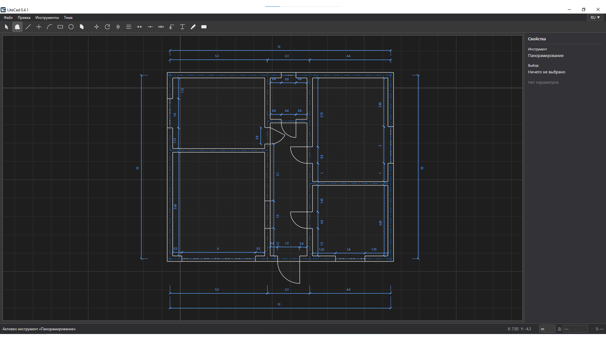

# LiteCAD

LiteCAD is a lightweight 2D CAD application for technical drawings, plans, and elevations.

**Developed by Siragudin Guseynov.**

<p align="center">
  
</p>

**Repository:** https://github.com/Siragudin/LiteCad

## Status

| | |
| --- | --- |
| Current version | 0.4.2 |
| Release | Beta |
| Platform | Windows |
| UI language | Russian / English |

## Features

Drawing and annotation tools available in the current codebase:

- Selection
- Hand / pan
- Line
- Axis
- Arc
- Circle
- Rectangle
- Sector
- Move
- Copy (interactive copy from the Edit menu)
- Mirror
- Rotate
- Stretch
- Extend
- Offset
- Dimension
- Leader / elevation leader
- Text (plain text and arrow/pointer text)
- Fill (including a wide diagonal hatch)
- Eraser

Also implemented:

- Object snapping while drawing and editing
- Orthogonal constraint for Line, Axis, Move, Mirror, and Dimension (where those tools expose it)
- Exact numeric input for length, size, offset, move, rotate, stretch, circle, arc, sector, and similar workflows that already use the status-bar input
- Undo / redo
- Project save and open
- Russian and English localization
- Light and dark themes
- PDF preview and PDF export, including physical lineweights (axes and dimensions use the PDF lineweight table)

## Current Beta Status

LiteCAD is currently in Beta. Core drawing and editing workflows are implemented, but some edge cases and known test issues remain. The project is actively being refined before a stable 1.0 release.

## Getting Started

This is a WPF desktop app targeting **.NET 10** (`net10.0-windows`).

Build:

```bash
dotnet build

Run:

```bash
dotnet run --project LiteCad.csproj
```

## Testing

The solution includes `LiteCad.Tests`.

```bash
dotnet test LiteCad.Tests/LiteCad.Tests.csproj
```

## Project Status / Roadmap

- Continue stabilizing the Beta
- Fix remaining edge cases
- Improve UX
- Prepare a stable 1.0 release

No dates or extra feature promises beyond that.

## License

LiteCAD is distributed under the MIT License. See [LICENSE](LICENSE).
